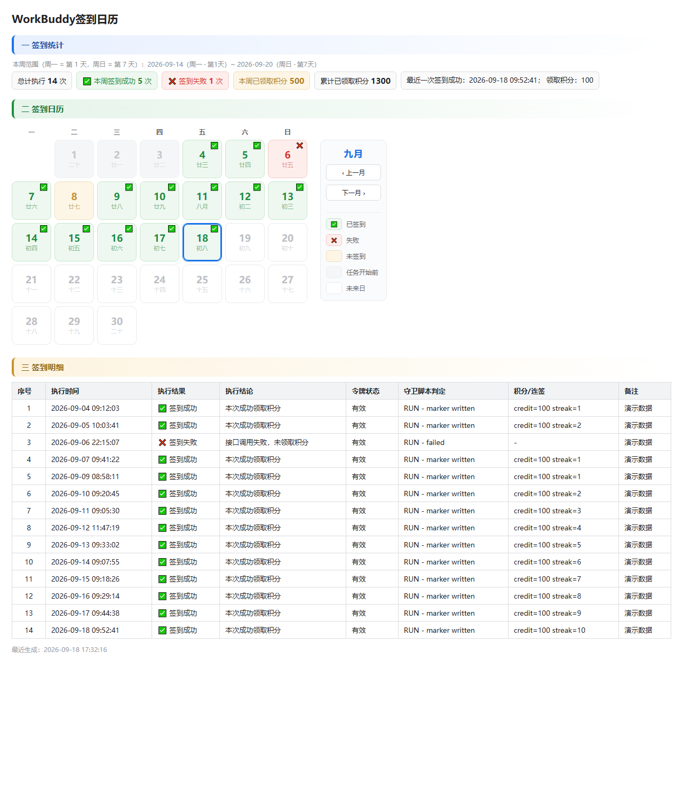

# WorkBuddy 签到日历

一个 WorkBuddy Skill：**自动完成每日积分签到，并把结果累积成一张可读、可核对的可视化记录表。**

产出为**纯静态 HTML**（零 JavaScript），包含统计卡片、带农历的五状态签到日历、以及可追溯的明细表；同时输出 CSV 源数据与 Markdown 版本。

> 本仓库是 Skill 本体，**已内置**依赖 Skill `workbuddy-checkin`（位于 `workbuddy-checkin/` 子目录，负责读取本地登录态、调用官方接口），开箱即用、无需额外安装；本 Skill 负责**调度 + 记录 + 渲染 + 核对**。

---

## 功能特性

- **自动签到 + 幂等**：任意时刻运行都会尝试签到，当天已签则直接跳过，**绝不重复领取**。
- **方案 A 提前退出**：当天已签到成功的后续触发不调用接口、不追加记录，只刷新状态文件 —— 每天通常只有一条真实记录。
- **可视化日历**：五状态（已签到 / 失败 / 未签到 / 任务开始前 / 未来日）+ 每日农历 + 今日高亮。
- **零 JavaScript**：月份切换、侧栏对齐全部用纯 CSS 实现（隐藏 `radio` + `:checked ~` 兄弟选择器）。适配不执行脚本的预览面板。
- **多维统计**：本周签到成功次数、本周已领取积分、累计已领取积分、最近一次签到详情。
- **补记工具**：当某天因手动签到等原因缺失积分时，可幂等补录，修正统计偏小问题。
- **滑动窗口日历**：恒为「当前月 ±12 个月」（25 个月），HTML 体积恒定不膨胀。

## 效果预览



*（图示为合成演示数据）*

## 快速开始

```powershell
# 签到一次并重建记录表（默认输出到 <当前目录>\signin-records）
powershell -ExecutionPolicy Bypass -File scripts\checkin_calendar.ps1

# 指定输出目录
powershell -ExecutionPolicy Bypass -File scripts\checkin_calendar.ps1 -OutDir "D:\data\signin-records"

# 只按现有 CSV 重建表格，不签到、不追加行（改样式后刷新用）
powershell -ExecutionPolicy Bypass -File scripts\checkin_calendar.ps1 -OutDir "<dir>" -RebuildOnly

# 排障：只打印依赖解析结果
powershell -ExecutionPolicy Bypass -File scripts\checkin_calendar.ps1 -ShowPaths
```

脚本不做交互，可安全重复运行。

### 参数

| 参数 | 默认 | 说明 |
|------|------|------|
| `-OutDir <path>` | `<当前目录>\signin-records` | 记录输出目录，不存在会自动创建 |
| `-RebuildOnly` | 关 | 只按现有 CSV 重建 MD/HTML，不签到、不追加行 |
| `-GuardPath <p>` | 自动定位 | 守卫脚本 `checkin_guard.ps1` 路径；默认自动找同级 `workbuddy-checkin` skill |
| `-Title <t>` | `WorkBuddy签到日历` | 页面标题 / MD 一级标题 |
| `-ShowPaths` | 关 | 只打印 `OUTDIR` / `GUARD` / `NODE` 解析结果后退出 |

### 输出文件

| 文件 | 内容 |
|------|------|
| `checkin-records.html` | **主要交付件**：统计卡片 + 五状态签到日历 + 明细表，纯静态 HTML/CSS |
| `checkin-records.csv` | 结构化源数据，可被 Excel / WPS 直接打开 |
| `checkin-records.md` | 可读 Markdown（统计小表格 + 本月日历小结 + 全量明细） |
| `last_run.txt` | 最近一次状态行，含 `hint=` 兜底提醒字段 |
| `last_guard_output.txt` | 最近一次守卫脚本原始输出，排障用 |

CSV 字段：`序号 / 执行时间 / 执行结果 / 执行结论 / 令牌状态 / 守卫脚本判定 / 积分·连签 / 备注`

## 统计口径

| 指标 | 口径 |
|------|------|
| 总计执行 | 表内全部记录行数 |
| 本周签到成功 | 本周内「签到成功」条数，上限 7 |
| 签到失败 | 全量「失败」条数 |
| 本周已领取积分 | 本周内各行 `credit=N` 累加，每周归零 |
| 累计已领取积分 | 全量 `credit=N` 累加 |
| 最近一次签到成功 | 最后一条**真实签到成功**记录（排除守卫跳过的行） |
| 本周范围 | 周一（第 1 天）~ 周日（第 7 天）；周日归属它之前那个周一所在的一周 |

**积分来源（重要）**：

- **单次积分是接口真值**，取自签到接口响应的 `data.credit` / `data.streak_days`，脚本内**没有任何 100 / 1000 硬编码常量**。
- **汇总积分是本地累加**，即对 CSV 各行 `credit=N` 求和。
- 由此存在一个**已知缺口**：若某天由用户在客户端手动签到（接口返回「已签到」），该天记录里没有 `credit` 值，不会进汇总 → 用 `add_record.py` 补记。

## 补记缺失记录

```bash
python scripts/add_record.py --csv <dir>/checkin-records.csv \
    --time "2026-09-14 09:27:14" --result "签到成功（补记）" \
    --credit 100 --streak 8 --unique-date \
    --note "接口返回「今日已签到」，按每日基础分记"
```

- 按 `--time` 升序插入并自动重排序号；`--unique-date` 表示该日期已有记录则跳过（幂等）。
- `--dry-run` 只预览不落盘。
- 补记后加 `-RebuildOnly` 重新渲染表格即可看到统计更新。

## 设计要点

- **禁止内嵌 JavaScript**。月份切换用隐藏 `input[type=radio]` + `label[for]` + `:checked ~` 实现；侧栏对齐用固定几何量（`th` 高 18px + `border-spacing:6px` ⇒ `.calside{margin-top:30px}`），不做运行时测量。
- **农历**采用 1900–2100 离线查表，无外部依赖。
- 明细表在 HTML 中只渲染最近 60 条（带提示行），CSV / MD 保留全量。
- 中文 `.ps1` 必须存为 **UTF-8 带 BOM**，否则 Windows PowerShell 5.1 会按 ANSI 读取而乱码。

更多实现细节、五状态配色、农历算法与已知坑见 [`references/design-notes.md`](references/design-notes.md)。

## 依赖

| 依赖 | 用途 | 缺失时 |
|------|------|--------|
| Skill `workbuddy-checkin`（**已内置**于 `workbuddy-checkin/`） | 读取本地登录态、调用签到接口（`checkin_guard.ps1`） | 极少见；可用 `-GuardPath` 指定其他路径 |
| Node.js | 守卫脚本解密本地登录态所需 | 用环境变量 `WB_CHECKIN_NODE` 或标准路径安装 |
| WorkBuddy 桌面端（已登录） | 提供本地登录态 | 无法签到，提示令牌不可用 |
| `curl.exe` | 守卫脚本调用接口 | Win10 1803+ 自带 |
| Python 3 | 仅 `add_record.py` 补记工具需要 | 不影响签到与渲染 |

脚本自动定位 Node（`WB_CHECKIN_NODE` → `~/.workbuddy/binaries/node/versions/*/node.exe` → `PATH` 中的 `node`）与守卫脚本（优先同级 skill `~/.workbuddy/skills/workbuddy-checkin/`，回退本仓库内置 `workbuddy-checkin/`）。用 `-ShowPaths` 查看实际解析结果。

## 目录结构

```
workbuddy-checkin-calendar/
├── SKILL.md                    # Skill 定义：触发词 / 参数 / 口径 / 幂等策略 / 排错
├── README.md
├── LICENSE
├── references/
│   └── design-notes.md         # 页面结构、纯静态切换、配色、农历、周定义、已知坑
├── docs/
│   └── demo.png
├── workbuddy-checkin/          # 内置依赖（vendored 子 skill）：读令牌 + 调官方接口
│   ├── SKILL.md  checkin_guard.ps1  scripts/  references/  images/
└── scripts/
    ├── checkin_calendar.ps1    # 核心：签到调度 + 记录表 + 日历渲染
    └── add_record.py           # 补记工具（幂等）
```

## 安全说明

- 本 Skill **不读取、不保存任何令牌**。令牌读取与网络请求全部在 `workbuddy-checkin` 的守卫脚本内完成，本 Skill 只消费其文本输出。
- 记录的 `积分/连签` 字段仅含 `credit=N streak=M`，**不含令牌、不含账号信息**。
- 本 Skill 自身不发起网络请求；间接请求仅发往官方接口。
- 写入范围仅限 `-OutDir` 指定目录内的 5 个记录文件。

## License

[MIT](LICENSE)
