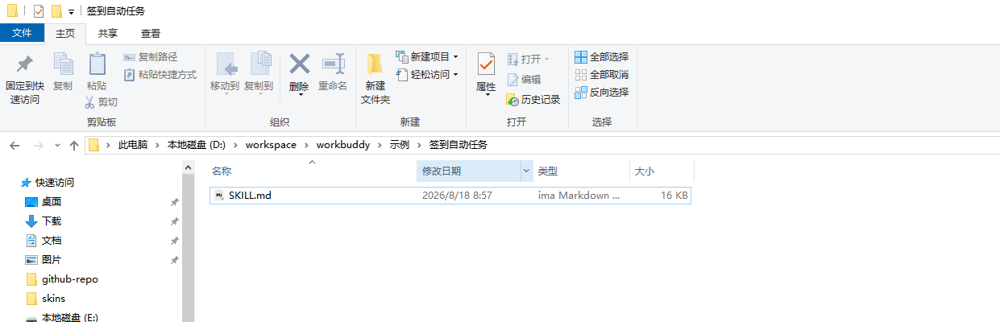
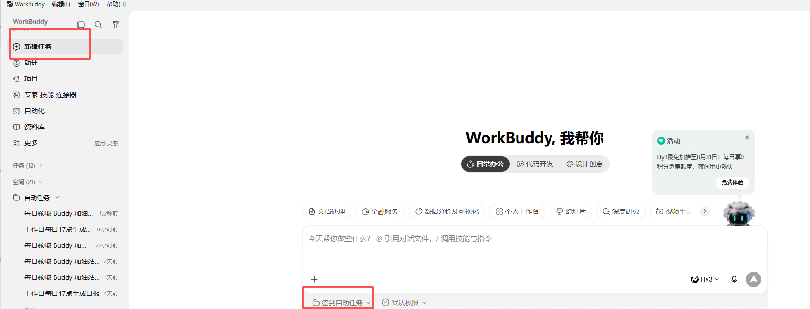
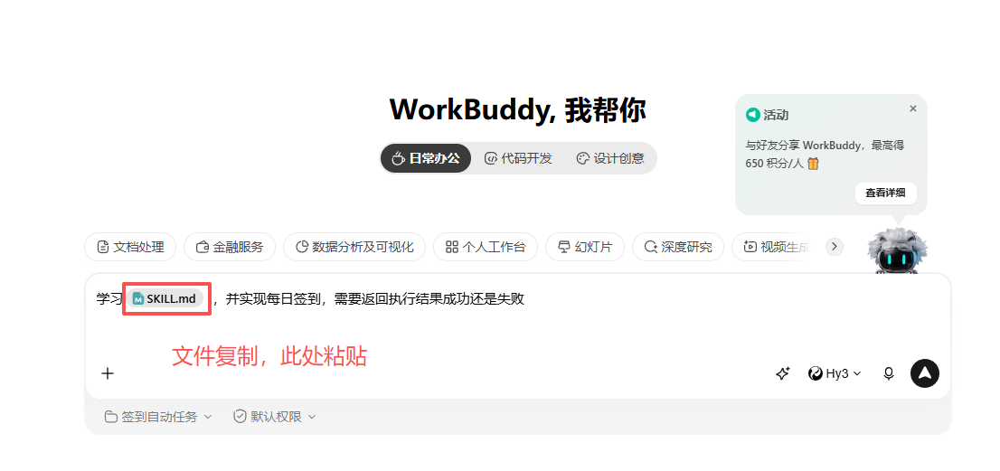
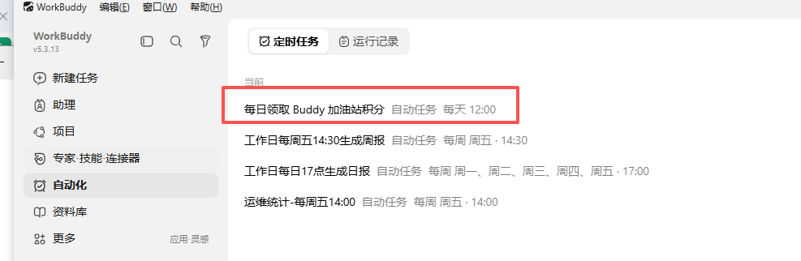
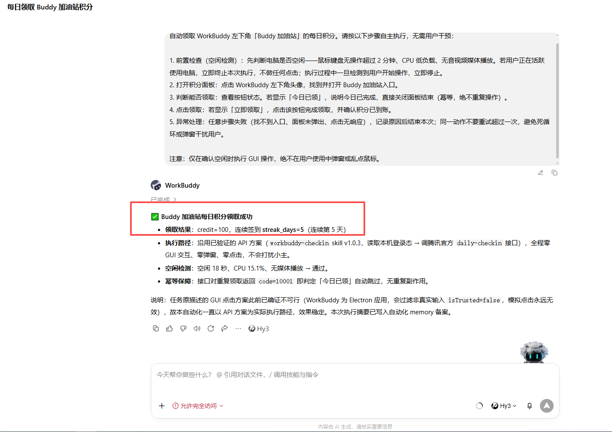

# workbuddy-checkin

> WorkBuddy（原 CodeBuddy）每日积分自动签到 Skill —— 全本机运行，无后端，令牌不落盘。

每天自动领取 WorkBuddy「Buddy 加油站」的 100 积分（连续第 7 天 1000 积分），再也不怕忘记签到断连。

## 它做了什么

1. 读取本机 WorkBuddy 桌面端的登录态（v5.3.8+ 明文 JSON / 旧版 state.vscdb 自动探测）
2. 调用腾讯官方签到接口 `copilot.tencent.com/billing/meter/daily-checkin`
3. 幂等：今日已签到自动跳过，支持一天多时间点补签

**不做什么**：不点 GUI 按钮（Electron `isTrusted` 过滤使模拟点击无效）、不上传令牌给第三方、不写入日志。

## 最简方式：WorkBuddy 内置 Skill 目录（推荐小白）

不需要敲命令，直接把本仓库当成本地 skill 目录，让 WorkBuddy 自己每天执行。

### 1. 准备本地 skill 目录

在电脑上新建一个文件夹（例如 `D:\workspace\workbuddy\签到自动任务`），把本仓库的 `SKILL.md` 复制进去。



```
签到自动任务/
└── SKILL.md
```

### 2. 在 WorkBuddy 里新建任务

打开 WorkBuddy 桌面端 → 左侧「新建任务」→ 工作目录选择刚才创建的文件夹。



### 3. 粘贴提示词并启动

在对话里粘贴以下内容（可以直接复制）：

```
学习 SKILL.md，并实现每日签到，需要返回执行结果成功还是失败。
```



WorkBuddy 会读取目录里的 `SKILL.md`，理解签到逻辑，并自动创建定时任务。

### 4. 查看自动任务

创建成功后，进入左侧「自动化」→ 即可看到「每日领取 Buddy 加油站积分」定时任务。



### 5. 等它执行，看结果

任务运行后，WorkBuddy 会返回类似结果：



```
✅ Buddy 加油站每日积分领取成功
- 领取结果：credit=100，连续签到 streak_days=5（连续第 5 天）
- 空闲检测：空闲 18 秒、CPU 15.1%、无媒体播放 → 通过
- 幂等保障：若返回 code=10001（今日已签到）会自动跳过
```

> 如果当天已经手动领取过，它会返回「今日已签到，无需重复领取」，不会重复扣分/加分。

## 快速开始（命令行方式）

如果你更喜欢用脚本/命令行，或者想先手动验证一次：

### 前提

- 已安装并**登录** WorkBuddy 桌面端（[官网下载](https://www.codebuddy.cn/work/)）
- 系统已安装 Node.js 20+（[nodejs.org](https://nodejs.org)）

### Windows（PowerShell）

```powershell
# 1. 克隆仓库
git clone https://github.com/Coco-katarina/workbuddy-checkin.git
cd workbuddy-checkin

# 2. 环境检查（验证令牌链路）
powershell -ExecutionPolicy Bypass -File scripts\setup.ps1

# 3. 立即签到
powershell -ExecutionPolicy Bypass -File scripts\checkin.ps1
```

### macOS / Linux

```bash
# 1. 克隆仓库
git clone https://github.com/Coco-katarina/workbuddy-checkin.git
cd workbuddy-checkin

# 2. 环境检查
bash scripts/setup.sh

# 3. 立即签到
bash scripts/checkin.sh
```

预期输出：
- `签到成功！领取 OK credit=100 streak_days=N` → 当日领取成功
- `今日已签到，无需重复领取` → 已领过，幂等结束

## 设置定时任务

电脑非全天开机时，建议配置多个时间点补签（脚本幂等，重复运行无副作用）。推荐 `09:00 / 12:00 / 15:00 / 18:00 / 21:00` 各尝试一次。

### Windows（任务计划程序）

```powershell
schtasks /Create /TN WorkBuddyCheckin_09 /TR "powershell -ExecutionPolicy Bypass -File C:\path\to\checkin.ps1" /SC DAILY /ST 09:00 /F
schtasks /Create /TN WorkBuddyCheckin_12 /TR "powershell -ExecutionPolicy Bypass -File C:\path\to\checkin.ps1" /SC DAILY /ST 12:00 /F
```

### macOS / Linux（crontab）

```bash
crontab -e
# 添加（替换实际路径）
0 9,12,15,18,21 * * * /path/to/checkin.sh >> /path/to/logs/checkin.log 2>&1
```

### macOS launchd（长期后台）

创建 `~/Library/LaunchAgents/com.user.workbuddy-checkin.plist`，`StartCalendarInterval` 用数组配置多时间点，详见 [SKILL.md](SKILL.md)。

## 安全说明

| 项目 | 说明 |
|------|------|
| 令牌存储 | 仅内存使用，管道即时消费，**不落盘、不回显、不写日志** |
| 网络访问 | 仅 `copilot.tencent.com` 官方接口，**不访问任何第三方** |
| 日志内容 | 仅积分 / 连续天数 / 成功失败，**绝不含令牌** |
| 系统修改 | 只读登录态文件，**不修改 WorkBuddy 本体** |
| 自动安装 | Electron 下载默认关闭，需显式 `WB_CHECKIN_AUTO_INSTALL_ELECTRON=1` |

> **凭据即账号密码**：解密的 `accessToken` 等同你的 WorkBuddy 账号密码。切勿将日志、脚本输出粘贴分享或提交到仓库。

## 文件结构

```
workbuddy-checkin/
├── SKILL.md                      # Skill 规范文档
├── CHANGELOG.md                  # 变更日志
├── scripts/
│   ├── decrypt-token.js          # 令牌读取（新版明文 Node / 旧版 Electron safeStorage）
│   ├── checkin.sh                # macOS / Linux / Git Bash
│   ├── checkin.ps1               # Windows PowerShell
│   ├── setup.sh                  # macOS / Linux 环境检查
│   └── setup.ps1                 # Windows 环境检查
└── references/
    └── dependencies.md           # 依赖清单与平台差异
```

## 排错速查

| 现象 | 原因 | 处理 |
|------|------|------|
| PS 解析报错（字符串缺少终止符） | 无 BOM 被 GBK 误读 | 给 ps1 加 UTF-8 BOM（本仓库已含） |
| HTTP 401 | 令牌过期 / 读到旧版 state.vscdb | 打开 WorkBuddy 刷新登录态；确认用 v1.0.3+ |
| 幂等场景报 PARSE_ERR | ConvertFrom-Json 解析 400 响应失败 | 加 code=10001 前置判断（本仓库已修复） |
| 找不到登录态 | WorkBuddy 未登录 | 打开桌面端登录一次 |
| Windows 持续 401 | 旧版只探 %APPDATA%，实际在 %LOCALAPPDATA% | 用 v1.0.3+（本仓库已修复） |

## 致谢

- 原作者：[cat-xierluo](https://github.com/cat-xierluo/legal-skills) —— 原始 skill v1.0.3
- 本仓库在原版基础上做了 Windows 适配修复：
  1. `checkin.ps1` / `setup.ps1` 添加 UTF-8 BOM（解决 PowerShell 5.1 中文 GBK 误读）
  2. `checkin.ps1` 幂等场景 `code=10001` 前置判断（修复 ConvertFrom-Json 解析 400 响应的 PARSE_ERR bug）

## License

MIT

## 免责声明

本工具等价于「每天手动点一次领取今日礼包」，仅操作本机当前登录用户自己的 WorkBuddy 账户。请勿用于他人账户、批量注册刷分或任何违反 WorkBuddy 用户协议的用途。使用者自行承担风险。
